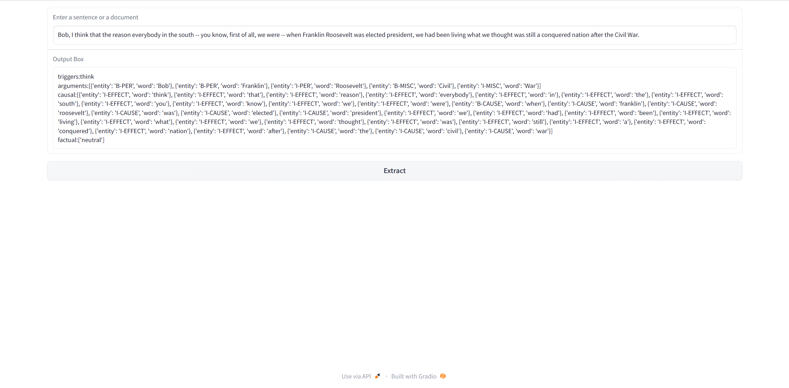

# Information Extraction Project
This project is an information extraction tool that includes four parts: named entity recognition, event extraction, 
event causality extraction, and event factual discrimination. The project is designed as 
a pipeline that applies different methods for each of the four parts. The final output is a web demo based on Gradio.
As far as I know, this is the most complete information extraction project.

## File Structure
```
information_extraction/
├── demo.py
├── README.md
├── tree.txt
├── demostrations/
│   ├── demo_casual.py
│   ├── demo_ee.py
│   ├── demo_factual.py
│   ├── demo_ner.py
│   └── __init__.py
├── images/
│   └── demo_img.png
├── my_ace2005/
│   ├── dev.json
│   ├── sample.json
│   ├── test.json
│   └── train.json
└── src/
    ├── Entity/
    │   ├── bash_entity.sh
    │   ├── demo_entity.py
    │   ├── README.md
    │   ├── run_entity.py
    │   ├── run_eval.py
    │   ├── entity/
    │   │   ├── models.py
    │   │   └── utils.py
    │   ├── entity_output/
    │   │   ├── ent_pred_dev.json
    │   │   └── train.log
    │   └── shared/
    │       ├── const.py
    │       ├── data_structures.py
    │       ├── get_hparams.py
    │       └── utils.py
    ├── Event/
    │   ├── consts.py
    │   ├── data_load.py
    │   ├── demo_event.py
    │   ├── eval.py
    │   ├── model.py
    │   ├── model_demo.py
    │   ├── params.py
    │   ├── train.py
    │   ├── train_eval.py
    │   └── utils.py
    ├── Event_causality/
    │   ├── bash_causal.sh
    │   ├── dataset.py
    │   ├── eval.py
    │   ├── model.py
    │   ├── output_with_scheduler.txt
    │   ├── output_wo_scheduler.txt
    │   ├── preprocess.py
    │   ├── read_document.py
    │   ├── train.py
    │   ├── utils.py
    │   └── scripts/
    │       ├── bash_train.sh
    │       └── bash_train_wo.sh
    └── Event_factuality/
        ├── bash_main.sh
        ├── config.py
        ├── dataset.py
        ├── main.py
        ├── model.py
        └── result/
            └── english_output_8.txt

```

## Installation
To use this project, you need to install the following dependencies:

* Python 3.6+
* PyTorch 1.4.0
* Transformers 2.5.0
* tensorboardX 1.8
* Flask 1.1.2
* Gradio 2.2.7

You can install these dependencies using pip. For example:
```bash
pip install torch==1.4.0
```

## Usage
### Pre-requisites
Python 3.7 or higher
PyTorch 1.7.1 or higher
transformers 4.2.2 or higher
flask 1.1.2 or higher
gradio 2.0.7 or higher
###  Installation
## Usage

After installing the dependencies, you can use the project as follows:

1. Navigate to the `src` folder.
2. Run the appropriate scripts for each part of the pipeline:

- For named entity recognition:
    ```
    cd Entity
    python run_entity.py --input_file input.txt --output_file output.txt
    ```
    - `input.txt`: path to the input file containing text to perform NER on.
    - `output.txt`: path to the output file to save NER results to.

- For event extraction:
    ```
    cd Event
    python train_eval.py
    ```
    This will train and evaluate the event extraction model using the default hyperparameters.

- For event causality extraction:
    ```
    cd Event_causality
    python preprocess.py --input_file input.json --output_file output.pkl --mode train
    python train.py --train_file train.pkl --dev_file dev.pkl
    ```
    - `input.json`: path to the input file containing event data in JSON format.
    - `output.pkl`: path to the output file to save preprocessed data to.
    - `train.pkl`, `dev.pkl`: paths to the preprocessed train and dev data files, respectively.

- For event factual discrimination:
    ```
    cd Event_factuality
    python main.py
    ```
    This will train and evaluate the event factual discrimination model.

3. To use the Gradio demo, navigate to the project root directory and run:
    ```
    python demo.py
    ```
    This will start the web demo on `http://localhost:7860/`.
The following is an example image of the web page demo


Note: For more details on how to use each part of the pipeline, please refer to the respective `README.md` files in their corresponding folders.

### Running the code on your own dataset
Modify the paths to your data in the appropriate scripts under src/Entity, src/Event, and src/Event_causality.
Run the scripts in the following order:
```bash
src/Entity/run_entity.py
src/Event/train_eval.py
src/Event_causality/train.py
src/Event_factuality/main.py
```

The output files will be generated in the appropriate directories under src/Entity/entity_output/, src/Event/model_output/, src/Event_causality/output/, and src/Event_factuality/result/ respectively.
## Acknowledgements
I would like to thank the following open-source projects and libraries for their contributions to this work:

* Hugging Face Transformers
* Flask
* Gradio